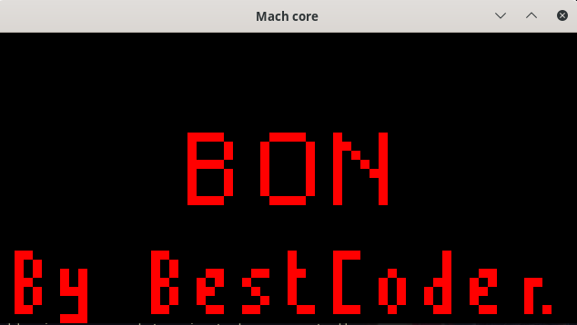
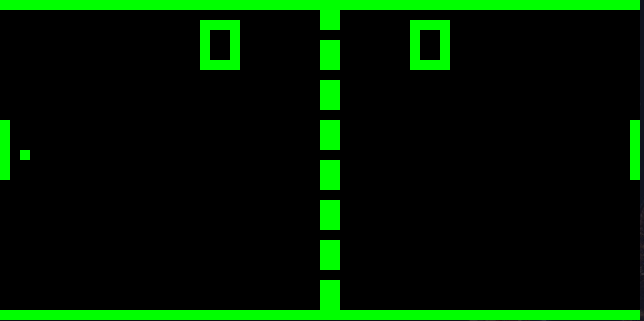
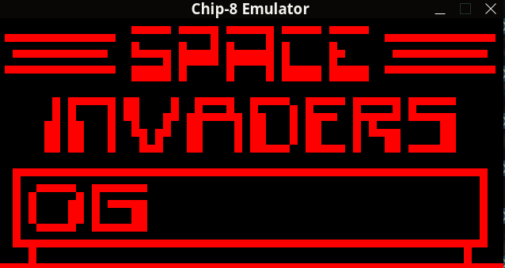

# A chip8 emulator (interpreter) written in zig
## Notes
The sound may not be well implemented, I ported it from another emulator
Tested with zig version 0.10.0-dev.3383+3cf8f283d

## Usage
Build and run with `zig build run-[sdl/mach/nc] -- "<Path to ROM>"`

## Showoff

## TODOS
- [ ] Add some Images or gifs to showcase the project
- [ ] Sound (Implemented for SDL and notcurses)
- [ ] Add debugging functionality (Small implementation with SDL and imgui for now)
- [ ] Add support for Octo

## Dependencies
- [zig](https://ziglang.org/)
- [zig-clap](https://github.com/Hejsil/zig-clap)
- [SDL.zig](https://github.com/MasterQ32/SDL.zig)
- [SDL](https://www.libsdl.org/index.php)
- [notcurses](https://github.com/dankamongmen/notcurses)
- [mach](https://github.com/hexops/mach)

## You can find some roms here
- [test-opcode.ch8](https://github.com/corax89/chip8-test-rom)
- [BC_test.ch8, CAVE, Maze, PONG, TANK, TETRIS](https://github.com/cj1128/chip8-emulator/tree/master/rom)
- [Chipquarium, Heart monitor, morse code](https://github.com/mattmikolay/chip-8)
- [Many more here](https://www.zophar.net/pdroms/chip8/chip-8-games-pack.html)
